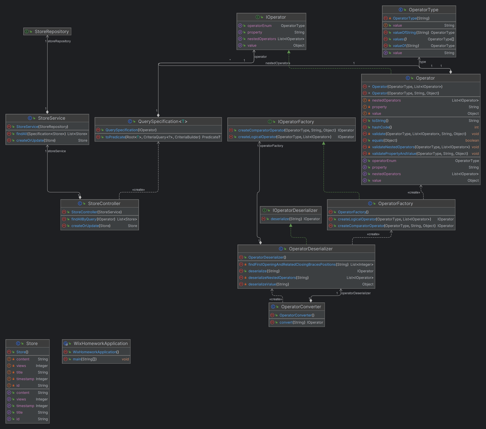

## Description

Homework for Wix. REST API to handle Store entity and provide ability to query stores using predefined operators.

Postman Collection for playing with API can be found here https://www.postman.com/donatasdaubar/workspace/wix-homework/overview

## System Diagrams



## Design Explanation
Project is split into two packages query and store. Query operators allow deeply nested operators within. I have
decided to use spring web, spring data jpa and h2 database.

### Store Packages
Store package uses Controller - Service - Repository pattern to expose REST API for Store entity.

### Query Package
Query package provides a library that will enable handling query operator that consists of predefined operators.
Implemented library provides a generic solution that isn't framework dependent or heavily tight to any specific
dependency. Although this package provides implementation for spring converter and spring jpa.

#### query.operator Package
Defines query operators and factory methods to build them. OperatorType enum defines available
operator types as enum values. OperatorFactory provides methods to create comparator and logical operators.
Operator class shapes what is a query operator.

#### query.jpa Package
Provides implementation on how to handle Operator to filter data in persistence layer. At the moment solution is tied
with spring jpa and Specification interface. In general, it is possible to define an interface with a method definition
that would handle this, but I was not able to pick a good way to make it generic and not tied spring data jpa.

#### query.serialization
Handles deserialization of query parameter. OperatorDeserializer provides an implementation that handles transformation
of string to Operator object. Spring package within provides an implementation of Converter interface and exposes
OperatorConverter as SpringBean, which allows to deserialize operator on controller level.

## Application Startup Instructions

### Running Application
```bash
# Install dependencies
$ ./mvnw install
# Run springboot
$ ./mvnw spring-boot:run
```

### Test
```bash
# Run tests
$ ./mvnw test
```